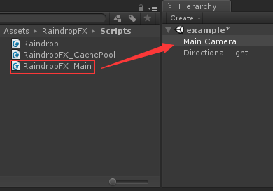
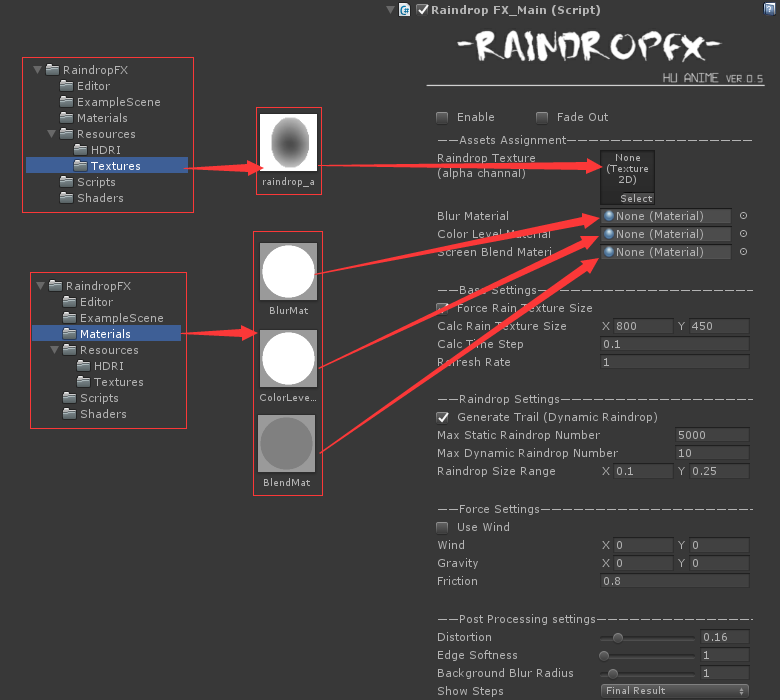
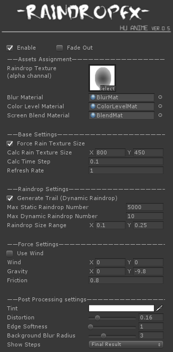
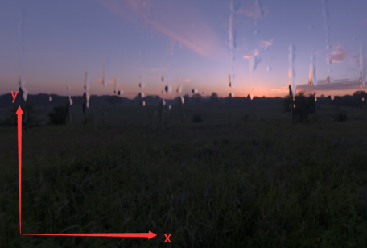
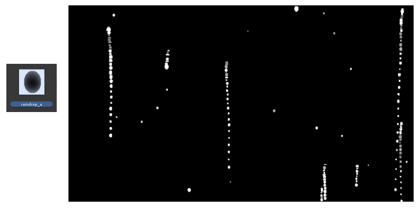
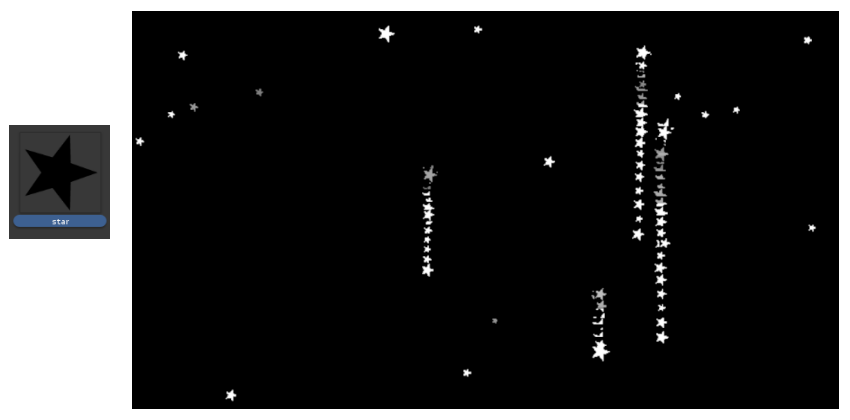

# RaindropFX - Lite

Easy to use C# scripts for realistic camera lens raindrop animation effects.

## 1 How to use
### (1) Drag "RaindropFX_Main" to your camera.

### (2) Find the following raindrop texture and materials. 
Or you can use your own raindrop texture. The calculation of the program is based on the alpha channel of the texture, so PNG format images with alpha channel are recommended.   
*Please do not change the raindrop texture when the game is running.

### (3) When using your own raindrop texture, turn on the "Read/Write Enabled".

### (4) Turn on "Enable".

### (5) Run your game.

## 2 System options

**Enable:**   
whether to enable raindropFX.  

**Fade Out:**   
when turn it on, there will be no new water droplets, and existing water droplets will gradually fade out and automatically close "Enable" after all water drops are killed.  

**Force Rain Texture Size:**   
when turn it on, raindropFX will always calculate the screen rain texture of the specified size (Calc Rain Texture Size) and then rescale it to the current screen resolution size.  
*When your game resolution is very large, opening this option will improve performance.  

**Calc Time Step:**   
The time step of physical calculation.  

**Refresh Rate:**   
For example, if you set it to 2, the raindrop animation will calculate every two frames.  

**Generate Trail:**   
Controls whether the dynamic water droplets produce a tail when they slide.  
When the dynamic water droplets produce a static tail drop, itself loses a certain amount of mass, which will affect the results of the physical calculation.  

**Max Static Raindrop Number/Max Dynamic Raindrop Number:**   
Water droplets are divided into two categories: static and dynamic.  
Static water droplets are generated on the screen at random locations and cannot be moved.  
Dynamic water droplets are generated by the physical computing movement.  

**Raindrop Size Range:**   
Calculate the size range of raindrops based on your raindrop texture.  

## 3 Tips
*RaindropFX screen force coordinate system:

Results of different raindrop textures: 

## Support
If you have any questions, comments, or requests for new features, please email me directly at: hztmailbox@gmail.com.

 
 

Welcome to visit my homepage: https://huanime.com.cn/.