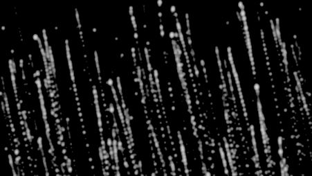
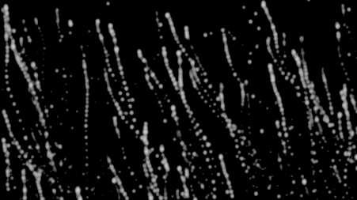
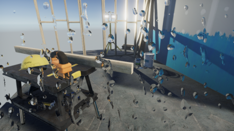
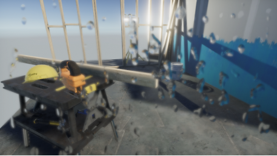
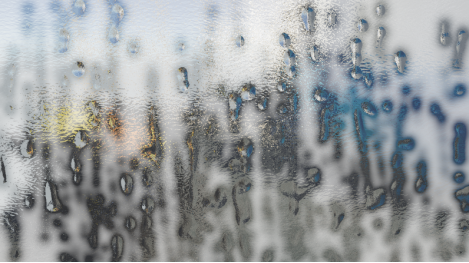
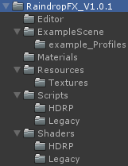
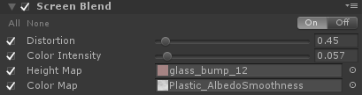
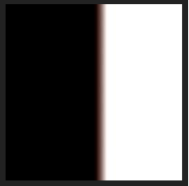
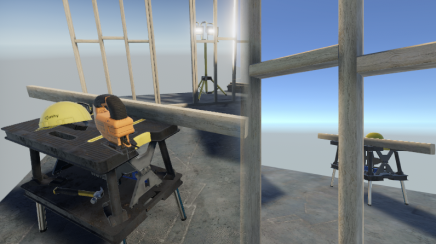

# RaindropFX - Pro

Easy to use realistic camera lens raindrop animation effects.

## 1 New Features
### 1-1 Wind turbulence

Wind without turbulence

Wind with turbulence

### 1-2 Foreground water droplets blur

Screen blend result without droplets blur

Screen blend result with droplets blur

### 1-3 Screen fog

Raindrop effect without screen fog

Raindrop effect with screen fog

## 2 Getting started
### 2-1 Install post processing stack V2
!> **Important** The post processing stack (v2) must be installed before you can continue.
You can either use the GitHub or Package Manager installation. 

Please choose your installation method according to the actual situation :
#### 1.For unity 2018.2 or higher
If you create your project using HDRP (High-Definition Render Pipeline) or LWRP (Lightweight Render Pipeline) template, Post Processing Stack (v2) will be included in your project automatically, you do not need to do anything.

Otherwise, you need to use the Package Manager or GitHub to install the Post Processing Stack (v2) :

#### 2.For unity 5.6.1-2018.1
Use the GitHub installation. The installation method is detailed in the installation documentation in the github project (https://github.com/Unity-Technologies/PostProcessing).

#### 3.For unity 5.4.3-5.6
Post processing stack (v2) may not work correctly with those old versions unity. If you want to use RaindropFX in those old versions unity, see section 5 legacy version.

### 2-2 Download RaindropFX to your project
If you have an old version RaindropFX v0.5.0, delete it first, then download and import RaindropFX V1.0.1 to your project, and you will see those files:

### 2-3 Post processing stack setup
#### 1. Camera setup
Select the main camera in your secne, and add a "Post Process Layer" script component. On the component, in the "Layer" dropdown, select the "PostProcessing" layer.

#### 2.Post process volume Setup
Go to "GameObject -> 3D Object -> Post-process Volume" to create a new volume object. On the "Post Process Volume" component, tick the "Global" box, then choose a profile in the profile field or create a new profile.

#### 3.Post process profile setup
On the "Post Process Volume" component, go to "Add effect -> RaindropFX -> CameraLensRain" to add the effect.

## 3 System options

<table cellspacing="0" cellpadding="0" style="border-collapse:collapse; margin-left:0pt; width:427.1pt"><tr style="height:46.2pt"><td style="background-color:#000000; border-bottom-color:#000000; border-bottom-style:solid; border-bottom-width:1pt; border-left-color:#000000; border-left-style:solid; border-left-width:1pt; border-right-color:#000000; border-right-style:dotted; border-right-width:1pt; border-top-color:#000000; border-top-style:solid; border-top-width:1pt; padding-left:4.9pt; padding-right:4.9pt; vertical-align:top; width:153pt">
Parameter
</td><td style="background-color:#000000; border-bottom-color:#000000; border-bottom-style:solid; border-bottom-width:1pt; border-left-color:#000000; border-left-style:dotted; border-left-width:1pt; border-right-color:#000000; border-right-style:solid; border-right-width:1pt; border-top-color:#000000; border-top-style:solid; border-top-width:1pt; padding-left:4.9pt; padding-right:4.9pt; vertical-align:top; width:251.5pt">
&#xa0;
</td></tr><tr style="height:31.2pt"><td style="background-color:#e7e7e7; border-bottom-color:#000000; border-bottom-style:solid; border-bottom-width:1pt; border-left-color:#000000; border-left-style:solid; border-left-width:1pt; border-right-color:#000000; border-right-style:dotted; border-right-width:1pt; border-top-color:#000000; border-top-style:solid; border-top-width:1pt; padding-left:4.9pt; padding-right:4.9pt; vertical-align:top; width:153pt">
Fadeout_fadein_switch
</td><td style="background-color:#e7e7e7; border-bottom-color:#000000; border-bottom-style:solid; border-bottom-width:1pt; border-left-color:#000000; border-left-style:dotted; border-left-width:1pt; border-right-color:#000000; border-right-style:solid; border-right-width:1pt; border-top-color:#000000; border-top-style:solid; border-top-width:1pt; padding-left:4.9pt; padding-right:4.9pt; vertical-align:top; width:251.5pt">
Waterdrops will fade in/out automatically if you disable/enable this.
</td></tr><tr style="height:31.2pt"><td style="background-color:#ffffff; border-bottom-color:#000000; border-bottom-style:solid; border-bottom-width:1pt; border-left-color:#000000; border-left-style:solid; border-left-width:1pt; border-right-color:#000000; border-right-style:dotted; border-right-width:1pt; border-top-color:#000000; border-top-style:solid; border-top-width:1pt; padding-left:4.9pt; padding-right:4.9pt; vertical-align:top; width:153pt">
Fast mode
</td><td style="background-color:#ffffff; border-bottom-color:#000000; border-bottom-style:solid; border-bottom-width:1pt; border-left-color:#000000; border-left-style:dotted; border-left-width:1pt; border-right-color:#000000; border-right-style:solid; border-right-width:1pt; border-top-color:#000000; border-top-style:solid; border-top-width:1pt; padding-left:4.9pt; padding-right:4.9pt; vertical-align:top; width:251.5pt">
Works with 'Fadeout_fadein_switch'. Waterdrops will fadeout with higher frame rate but lower accuracy if you turn it on. 

*It will greatly affect the effect of screen fog.
</td></tr><tr style="height:31.2pt"><td style="background-color:#e7e7e7; border-bottom-color:#000000; border-bottom-style:solid; border-bottom-width:1pt; border-left-color:#000000; border-left-style:solid; border-left-width:1pt; border-right-color:#000000; border-right-style:dotted; border-right-width:1pt; border-top-color:#000000; border-top-style:solid; border-top-width:1pt; padding-left:4.9pt; padding-right:4.9pt; vertical-align:top; width:153pt">
Fade speed
</td><td style="background-color:#e7e7e7; border-bottom-color:#000000; border-bottom-style:solid; border-bottom-width:1pt; border-left-color:#000000; border-left-style:dotted; border-left-width:1pt; border-right-color:#000000; border-right-style:solid; border-right-width:1pt; border-top-color:#000000; border-top-style:solid; border-top-width:1pt; padding-left:4.9pt; padding-right:4.9pt; vertical-align:top; width:251.5pt">
The speed of waterdrops fadeout. The bigger, the faster.
</td></tr><tr style="height:31.2pt"><td style="background-color:#ffffff; border-bottom-color:#000000; border-bottom-style:solid; border-bottom-width:1pt; border-left-color:#000000; border-left-style:solid; border-left-width:1pt; border-right-color:#000000; border-right-style:dotted; border-right-width:1pt; border-top-color:#000000; border-top-style:solid; border-top-width:1pt; padding-left:4.9pt; padding-right:4.9pt; vertical-align:top; width:153pt">
Raindrop tex_alpha
</td><td style="background-color:#ffffff; border-bottom-color:#000000; border-bottom-style:solid; border-bottom-width:1pt; border-left-color:#000000; border-left-style:dotted; border-left-width:1pt; border-right-color:#000000; border-right-style:solid; border-right-width:1pt; border-top-color:#000000; border-top-style:solid; border-top-width:1pt; padding-left:4.9pt; padding-right:4.9pt; vertical-align:top; width:251.5pt">
Raindrop texture must be set before you can use RaindropFX. Find the raindrop texture at "RaindropFX_V1.0.1/Resources/Textures/raindrop_a". Or you can use your own raindrop texture. 

*The calculation of the program is based on the alpha channel of the texture, so PNG format images with alpha channel are recommended. 
</td></tr><tr style="height:31.2pt"><td style="background-color:#e7e7e7; border-bottom-color:#000000; border-bottom-style:solid; border-bottom-width:1pt; border-left-color:#000000; border-left-style:solid; border-left-width:1pt; border-right-color:#000000; border-right-style:dotted; border-right-width:1pt; border-top-color:#000000; border-top-style:solid; border-top-width:1pt; padding-left:4.9pt; padding-right:4.9pt; vertical-align:top; width:153pt">
Force rain texture size
</td><td rowspan="2" style="background-color:#e7e7e7; border-bottom-color:#000000; border-bottom-style:solid; border-bottom-width:1pt; border-left-color:#000000; border-left-style:dotted; border-left-width:1pt; border-right-color:#000000; border-right-style:solid; border-right-width:1pt; border-top-color:#000000; border-top-style:solid; border-top-width:1pt; padding-left:4.9pt; padding-right:4.9pt; vertical-align:top; width:251.5pt">
When turn it on, raindropFX will always calculate the screen rain texture of the specified size(Calc Rain Texture Size) and then rescale it to the current screen resolution size. When your game resolution is very large, opening this option will improve performance.
</td></tr><tr style="height:31.2pt"><td style="background-color:#ffffff; border-bottom-color:#000000; border-bottom-style:solid; border-bottom-width:1pt; border-left-color:#000000; border-left-style:solid; border-left-width:1pt; border-right-color:#000000; border-right-style:dotted; border-right-width:1pt; border-top-color:#000000; border-top-style:solid; border-top-width:1pt; padding-left:4.9pt; padding-right:4.9pt; vertical-align:top; width:153pt">
Calc rain texture size
</td></tr><tr style="height:31.2pt"><td style="background-color:#e7e7e7; border-bottom-color:#000000; border-bottom-style:solid; border-bottom-width:1pt; border-left-color:#000000; border-left-style:solid; border-left-width:1pt; border-right-color:#000000; border-right-style:dotted; border-right-width:1pt; border-top-color:#000000; border-top-style:solid; border-top-width:1pt; padding-left:4.9pt; padding-right:4.9pt; vertical-align:top; width:153pt">
Calc time step
</td><td style="background-color:#e7e7e7; border-bottom-color:#000000; border-bottom-style:solid; border-bottom-width:1pt; border-left-color:#000000; border-left-style:dotted; border-left-width:1pt; border-right-color:#000000; border-right-style:solid; border-right-width:1pt; border-top-color:#000000; border-top-style:solid; border-top-width:1pt; padding-left:4.9pt; padding-right:4.9pt; vertical-align:top; width:251.5pt">
The time step of physical calculation.
</td></tr><tr style="height:31.2pt"><td style="background-color:#ffffff; border-bottom-color:#000000; border-bottom-style:solid; border-bottom-width:1pt; border-left-color:#000000; border-left-style:solid; border-left-width:1pt; border-right-color:#000000; border-right-style:dotted; border-right-width:1pt; border-top-color:#000000; border-top-style:solid; border-top-width:1pt; padding-left:4.9pt; padding-right:4.9pt; vertical-align:top; width:153pt">
Refresh rate
</td><td style="background-color:#ffffff; border-bottom-color:#000000; border-bottom-style:solid; border-bottom-width:1pt; border-left-color:#000000; border-left-style:dotted; border-left-width:1pt; border-right-color:#000000; border-right-style:solid; border-right-width:1pt; border-top-color:#000000; border-top-style:solid; border-top-width:1pt; padding-left:4.9pt; padding-right:4.9pt; vertical-align:top; width:251.5pt">
For example, if you set it to 2, the raindrop animation will calculate every two frames.
</td></tr><tr style="height:31.2pt"><td style="background-color:#e7e7e7; border-bottom-color:#000000; border-bottom-style:solid; border-bottom-width:1pt; border-left-color:#000000; border-left-style:solid; border-left-width:1pt; border-right-color:#000000; border-right-style:dotted; border-right-width:1pt; border-top-color:#000000; border-top-style:solid; border-top-width:1pt; padding-left:4.9pt; padding-right:4.9pt; vertical-align:top; width:153pt">
Generate trail
</td><td style="background-color:#e7e7e7; border-bottom-color:#000000; border-bottom-style:solid; border-bottom-width:1pt; border-left-color:#000000; border-left-style:dotted; border-left-width:1pt; border-right-color:#000000; border-right-style:solid; border-right-width:1pt; border-top-color:#000000; border-top-style:solid; border-top-width:1pt; padding-left:4.9pt; padding-right:4.9pt; vertical-align:top; width:251.5pt">
Controls whether the dynamic water droplets produce a tail when they slide. When the dynamic water droplets produce a static tail drop, itself loses a certain amount of mass, which will affect the results of the physical calculation.
</td></tr><tr style="height:31.2pt"><td style="background-color:#ffffff; border-bottom-color:#000000; border-bottom-style:solid; border-bottom-width:1pt; border-left-color:#000000; border-left-style:solid; border-left-width:1pt; border-right-color:#000000; border-right-style:dotted; border-right-width:1pt; border-top-color:#000000; border-top-style:solid; border-top-width:1pt; padding-left:4.9pt; padding-right:4.9pt; vertical-align:top; width:153pt">
Max static raindrop number
</td><td rowspan="2" style="background-color:#ffffff; border-bottom-color:#000000; border-bottom-style:solid; border-bottom-width:1pt; border-left-color:#000000; border-left-style:dotted; border-left-width:1pt; border-right-color:#000000; border-right-style:solid; border-right-width:1pt; border-top-color:#000000; border-top-style:solid; border-top-width:1pt; padding-left:4.9pt; padding-right:4.9pt; vertical-align:top; width:251.5pt">
Water droplets are divided into two categories: static and dynamic. Static water droplets are generated on the screen at random locations and cannot be moved. Dynamic water droplets are generated by the physical computing movement.
</td></tr><tr style="height:31.2pt"><td style="background-color:#e7e7e7; border-bottom-color:#000000; border-bottom-style:solid; border-bottom-width:1pt; border-left-color:#000000; border-left-style:solid; border-left-width:1pt; border-right-color:#000000; border-right-style:dotted; border-right-width:1pt; border-top-color:#000000; border-top-style:solid; border-top-width:1pt; padding-left:4.9pt; padding-right:4.9pt; vertical-align:top; width:153pt">
Max dynamic raindrop number
</td></tr><tr style="height:31.2pt"><td style="background-color:#ffffff; border-bottom-color:#000000; border-bottom-style:solid; border-bottom-width:1pt; border-left-color:#000000; border-left-style:solid; border-left-width:1pt; border-right-color:#000000; border-right-style:dotted; border-right-width:1pt; border-top-color:#000000; border-top-style:solid; border-top-width:1pt; padding-left:4.9pt; padding-right:4.9pt; vertical-align:top; width:153pt">
Raindrop size range
</td><td style="background-color:#ffffff; border-bottom-color:#000000; border-bottom-style:solid; border-bottom-width:1pt; border-left-color:#000000; border-left-style:dotted; border-left-width:1pt; border-right-color:#000000; border-right-style:solid; border-right-width:1pt; border-top-color:#000000; border-top-style:solid; border-top-width:1pt; padding-left:4.9pt; padding-right:4.9pt; vertical-align:top; width:251.5pt">
Calculate the size range of raindrops based on your raindrop texture.
</td></tr><tr style="height:31.2pt"><td style="background-color:#e7e7e7; border-bottom-color:#000000; border-bottom-style:solid; border-bottom-width:1pt; border-left-color:#000000; border-left-style:solid; border-left-width:1pt; border-right-color:#000000; border-right-style:dotted; border-right-width:1pt; border-top-color:#000000; border-top-style:solid; border-top-width:1pt; padding-left:4.9pt; padding-right:4.9pt; vertical-align:top; width:153pt">
Use wind
</td><td style="background-color:#e7e7e7; border-bottom-color:#000000; border-bottom-style:solid; border-bottom-width:1pt; border-left-color:#000000; border-left-style:dotted; border-left-width:1pt; border-right-color:#000000; border-right-style:solid; border-right-width:1pt; border-top-color:#000000; border-top-style:solid; border-top-width:1pt; padding-left:4.9pt; padding-right:4.9pt; vertical-align:top; width:251.5pt">
Tick this if you want to use screen wind.
</td></tr><tr style="height:31.2pt"><td style="background-color:#ffffff; border-bottom-color:#000000; border-bottom-style:solid; border-bottom-width:1pt; border-left-color:#000000; border-left-style:solid; border-left-width:1pt; border-right-color:#000000; border-right-style:dotted; border-right-width:1pt; border-top-color:#000000; border-top-style:solid; border-top-width:1pt; padding-left:4.9pt; padding-right:4.9pt; vertical-align:top; width:153pt">
Wind turbulence
</td><td style="background-color:#ffffff; border-bottom-color:#000000; border-bottom-style:solid; border-bottom-width:1pt; border-left-color:#000000; border-left-style:dotted; border-left-width:1pt; border-right-color:#000000; border-right-style:solid; border-right-width:1pt; border-top-color:#000000; border-top-style:solid; border-top-width:1pt; padding-left:4.9pt; padding-right:4.9pt; vertical-align:top; width:251.5pt">
Controls wind turbulence amount.
</td></tr><tr style="height:31.2pt"><td style="background-color:#e7e7e7; border-bottom-color:#000000; border-bottom-style:solid; border-bottom-width:1pt; border-left-color:#000000; border-left-style:solid; border-left-width:1pt; border-right-color:#000000; border-right-style:dotted; border-right-width:1pt; border-top-color:#000000; border-top-style:solid; border-top-width:1pt; padding-left:4.9pt; padding-right:4.9pt; vertical-align:top; width:153pt">
Wind turb scale
</td><td style="background-color:#e7e7e7; border-bottom-color:#000000; border-bottom-style:solid; border-bottom-width:1pt; border-left-color:#000000; border-left-style:dotted; border-left-width:1pt; border-right-color:#000000; border-right-style:solid; border-right-width:1pt; border-top-color:#000000; border-top-style:solid; border-top-width:1pt; padding-left:4.9pt; padding-right:4.9pt; vertical-align:top; width:251.5pt">
Adjust scale of the wind turbulence.
</td></tr><tr style="height:31.2pt"><td style="background-color:#ffffff; border-bottom-color:#000000; border-bottom-style:solid; border-bottom-width:1pt; border-left-color:#000000; border-left-style:solid; border-left-width:1pt; border-right-color:#000000; border-right-style:dotted; border-right-width:1pt; border-top-color:#000000; border-top-style:solid; border-top-width:1pt; padding-left:4.9pt; padding-right:4.9pt; vertical-align:top; width:153pt">
Wind
</td><td style="background-color:#ffffff; border-bottom-color:#000000; border-bottom-style:solid; border-bottom-width:1pt; border-left-color:#000000; border-left-style:dotted; border-left-width:1pt; border-right-color:#000000; border-right-style:solid; border-right-width:1pt; border-top-color:#000000; border-top-style:solid; border-top-width:1pt; padding-left:4.9pt; padding-right:4.9pt; vertical-align:top; width:251.5pt">
Wind power adjustment.
</td></tr><tr style="height:31.2pt"><td style="background-color:#e7e7e7; border-bottom-color:#000000; border-bottom-style:solid; border-bottom-width:1pt; border-left-color:#000000; border-left-style:solid; border-left-width:1pt; border-right-color:#000000; border-right-style:dotted; border-right-width:1pt; border-top-color:#000000; border-top-style:solid; border-top-width:1pt; padding-left:4.9pt; padding-right:4.9pt; vertical-align:top; width:153pt">
Gravity
</td><td style="background-color:#e7e7e7; border-bottom-color:#000000; border-bottom-style:solid; border-bottom-width:1pt; border-left-color:#000000; border-left-style:dotted; border-left-width:1pt; border-right-color:#000000; border-right-style:solid; border-right-width:1pt; border-top-color:#000000; border-top-style:solid; border-top-width:1pt; padding-left:4.9pt; padding-right:4.9pt; vertical-align:top; width:251.5pt">
Gravity adjustment.
</td></tr><tr style="height:31.2pt"><td style="background-color:#ffffff; border-bottom-color:#000000; border-bottom-style:solid; border-bottom-width:1pt; border-left-color:#000000; border-left-style:solid; border-left-width:1pt; border-right-color:#000000; border-right-style:dotted; border-right-width:1pt; border-top-color:#000000; border-top-style:solid; border-top-width:1pt; padding-left:4.9pt; padding-right:4.9pt; vertical-align:top; width:153pt">
Friction
</td><td style="background-color:#ffffff; border-bottom-color:#000000; border-bottom-style:solid; border-bottom-width:1pt; border-left-color:#000000; border-left-style:dotted; border-left-width:1pt; border-right-color:#000000; border-right-style:solid; border-right-width:1pt; border-top-color:#000000; border-top-style:solid; border-top-width:1pt; padding-left:4.9pt; padding-right:4.9pt; vertical-align:top; width:251.5pt">
Friction adjustment.
</td></tr><tr style="height:31.2pt"><td style="background-color:#e7e7e7; border-bottom-color:#000000; border-bottom-style:solid; border-bottom-width:1pt; border-left-color:#000000; border-left-style:solid; border-left-width:1pt; border-right-color:#000000; border-right-style:dotted; border-right-width:1pt; border-top-color:#000000; border-top-style:solid; border-top-width:1pt; padding-left:4.9pt; padding-right:4.9pt; vertical-align:top; width:153pt">
Distortion
</td><td style="background-color:#e7e7e7; border-bottom-color:#000000; border-bottom-style:solid; border-bottom-width:1pt; border-left-color:#000000; border-left-style:dotted; border-left-width:1pt; border-right-color:#000000; border-right-style:solid; border-right-width:1pt; border-top-color:#000000; border-top-style:solid; border-top-width:1pt; padding-left:4.9pt; padding-right:4.9pt; vertical-align:top; width:251.5pt">
Screen blend effect intensity. The larger the value, the stronger the distortion.
</td></tr><tr style="height:31.2pt"><td style="background-color:#ffffff; border-bottom-color:#000000; border-bottom-style:solid; border-bottom-width:1pt; border-left-color:#000000; border-left-style:solid; border-left-width:1pt; border-right-color:#000000; border-right-style:dotted; border-right-width:1pt; border-top-color:#000000; border-top-style:solid; border-top-width:1pt; padding-left:4.9pt; padding-right:4.9pt; vertical-align:top; width:153pt">
Use fog
</td><td style="background-color:#ffffff; border-bottom-color:#000000; border-bottom-style:solid; border-bottom-width:1pt; border-left-color:#000000; border-left-style:dotted; border-left-width:1pt; border-right-color:#000000; border-right-style:solid; border-right-width:1pt; border-top-color:#000000; border-top-style:solid; border-top-width:1pt; padding-left:4.9pt; padding-right:4.9pt; vertical-align:top; width:251.5pt">
If you want to use screen fog, turn it on.
</td></tr><tr style="height:31.2pt"><td style="background-color:#e7e7e7; border-bottom-color:#000000; border-bottom-style:solid; border-bottom-width:1pt; border-left-color:#000000; border-left-style:solid; border-left-width:1pt; border-right-color:#000000; border-right-style:dotted; border-right-width:1pt; border-top-color:#000000; border-top-style:solid; border-top-width:1pt; padding-left:4.9pt; padding-right:4.9pt; vertical-align:top; width:153pt">
Fog intensity
</td><td style="background-color:#e7e7e7; border-bottom-color:#000000; border-bottom-style:solid; border-bottom-width:1pt; border-left-color:#000000; border-left-style:dotted; border-left-width:1pt; border-right-color:#000000; border-right-style:solid; border-right-width:1pt; border-top-color:#000000; border-top-style:solid; border-top-width:1pt; padding-left:4.9pt; padding-right:4.9pt; vertical-align:top; width:251.5pt">
Screen fog effect intensity.
</td></tr><tr style="height:31.2pt"><td style="background-color:#ffffff; border-bottom-color:#000000; border-bottom-style:solid; border-bottom-width:1pt; border-left-color:#000000; border-left-style:solid; border-left-width:1pt; border-right-color:#000000; border-right-style:dotted; border-right-width:1pt; border-top-color:#000000; border-top-style:solid; border-top-width:1pt; padding-left:4.9pt; padding-right:4.9pt; vertical-align:top; width:153pt">
For iteration
</td><td style="background-color:#ffffff; border-bottom-color:#000000; border-bottom-style:solid; border-bottom-width:1pt; border-left-color:#000000; border-left-style:dotted; border-left-width:1pt; border-right-color:#000000; border-right-style:solid; border-right-width:1pt; border-top-color:#000000; border-top-style:solid; border-top-width:1pt; padding-left:4.9pt; padding-right:4.9pt; vertical-align:top; width:251.5pt">
Controls the effect of water droplet wake on fog.
</td></tr><tr style="height:31.2pt"><td style="background-color:#e7e7e7; border-bottom-color:#000000; border-bottom-style:solid; border-bottom-width:1pt; border-left-color:#000000; border-left-style:solid; border-left-width:1pt; border-right-color:#000000; border-right-style:dotted; border-right-width:1pt; border-top-color:#000000; border-top-style:solid; border-top-width:1pt; padding-left:4.9pt; padding-right:4.9pt; vertical-align:top; width:153pt">
Edge softness
</td><td style="background-color:#e7e7e7; border-bottom-color:#000000; border-bottom-style:solid; border-bottom-width:1pt; border-left-color:#000000; border-left-style:dotted; border-left-width:1pt; border-right-color:#000000; border-right-style:solid; border-right-width:1pt; border-top-color:#000000; border-top-style:solid; border-top-width:1pt; padding-left:4.9pt; padding-right:4.9pt; vertical-align:top; width:251.5pt">
Edge softness of water droplets.
</td></tr><tr style="height:31.2pt"><td style="background-color:#ffffff; border-bottom-color:#000000; border-bottom-style:solid; border-bottom-width:1pt; border-left-color:#000000; border-left-style:solid; border-left-width:1pt; border-right-color:#000000; border-right-style:dotted; border-right-width:1pt; border-top-color:#000000; border-top-style:solid; border-top-width:1pt; padding-left:4.9pt; padding-right:4.9pt; vertical-align:top; width:153pt">
In black
</td><td rowspan="4" style="background-color:#ffffff; border-bottom-color:#000000; border-bottom-style:solid; border-bottom-width:1pt; border-left-color:#000000; border-left-style:dotted; border-left-width:1pt; border-right-color:#000000; border-right-style:solid; border-right-width:1pt; border-top-color:#000000; border-top-style:solid; border-top-width:1pt; padding-left:4.9pt; padding-right:4.9pt; vertical-align:top; width:251.5pt">
Color level parameters. 

Can be used to adjust the "cutoff" effect of waterdrop edge.
</td></tr><tr style="height:31.2pt"><td style="background-color:#e7e7e7; border-bottom-color:#000000; border-bottom-style:solid; border-bottom-width:1pt; border-left-color:#000000; border-left-style:solid; border-left-width:1pt; border-right-color:#000000; border-right-style:dotted; border-right-width:1pt; border-top-color:#000000; border-top-style:solid; border-top-width:1pt; padding-left:4.9pt; padding-right:4.9pt; vertical-align:top; width:153pt">
In white
</td></tr><tr style="height:31.2pt"><td style="background-color:#ffffff; border-bottom-color:#000000; border-bottom-style:solid; border-bottom-width:1pt; border-left-color:#000000; border-left-style:solid; border-left-width:1pt; border-right-color:#000000; border-right-style:dotted; border-right-width:1pt; border-top-color:#000000; border-top-style:solid; border-top-width:1pt; padding-left:4.9pt; padding-right:4.9pt; vertical-align:top; width:153pt">
Out white
</td></tr><tr style="height:31.2pt"><td style="background-color:#e7e7e7; border-bottom-color:#000000; border-bottom-style:solid; border-bottom-width:1pt; border-left-color:#000000; border-left-style:solid; border-left-width:1pt; border-right-color:#000000; border-right-style:dotted; border-right-width:1pt; border-top-color:#000000; border-top-style:solid; border-top-width:1pt; padding-left:4.9pt; padding-right:4.9pt; vertical-align:top; width:153pt">
Out black
</td></tr><tr style="height:31.2pt"><td style="background-color:#ffffff; border-bottom-color:#000000; border-bottom-style:solid; border-bottom-width:1pt; border-left-color:#000000; border-left-style:solid; border-left-width:1pt; border-right-color:#000000; border-right-style:dotted; border-right-width:1pt; border-top-color:#000000; border-top-style:solid; border-top-width:1pt; padding-left:4.9pt; padding-right:4.9pt; vertical-align:top; width:153pt">
Droplet blur
</td><td style="background-color:#ffffff; border-bottom-color:#000000; border-bottom-style:solid; border-bottom-width:1pt; border-left-color:#000000; border-left-style:dotted; border-left-width:1pt; border-right-color:#000000; border-right-style:solid; border-right-width:1pt; border-top-color:#000000; border-top-style:solid; border-top-width:1pt; padding-left:4.9pt; padding-right:4.9pt; vertical-align:top; width:251.5pt">
Enable this if you want to blur foreground waterdrops.
</td></tr><tr style="height:31.2pt"><td style="background-color:#e7e7e7; border-bottom-color:#000000; border-bottom-style:solid; border-bottom-width:1pt; border-left-color:#000000; border-left-style:solid; border-left-width:1pt; border-right-color:#000000; border-right-style:dotted; border-right-width:1pt; border-top-color:#000000; border-top-style:solid; border-top-width:1pt; padding-left:4.9pt; padding-right:4.9pt; vertical-align:top; width:153pt">
Focalize
</td><td style="background-color:#e7e7e7; border-bottom-color:#000000; border-bottom-style:solid; border-bottom-width:1pt; border-left-color:#000000; border-left-style:dotted; border-left-width:1pt; border-right-color:#000000; border-right-style:solid; border-right-width:1pt; border-top-color:#000000; border-top-style:solid; border-top-width:1pt; padding-left:4.9pt; padding-right:4.9pt; vertical-align:top; width:251.5pt">
Adjust focal length.
</td></tr><tr style="height:31.2pt"><td style="background-color:#ffffff; border-bottom-color:#000000; border-bottom-style:solid; border-bottom-width:1pt; border-left-color:#000000; border-left-style:solid; border-left-width:1pt; border-right-color:#000000; border-right-style:dotted; border-right-width:1pt; border-top-color:#000000; border-top-style:solid; border-top-width:1pt; padding-left:4.9pt; padding-right:4.9pt; vertical-align:top; width:153pt">
Blur iteration
</td><td style="background-color:#ffffff; border-bottom-color:#000000; border-bottom-style:solid; border-bottom-width:1pt; border-left-color:#000000; border-left-style:dotted; border-left-width:1pt; border-right-color:#000000; border-right-style:solid; border-right-width:1pt; border-top-color:#000000; border-top-style:solid; border-top-width:1pt; padding-left:4.9pt; padding-right:4.9pt; vertical-align:top; width:251.5pt">
Adjust blur strength.
</td></tr><tr style="height:31.2pt"><td style="background-color:#e7e7e7; border-bottom-color:#000000; border-bottom-style:solid; border-bottom-width:1pt; border-left-color:#000000; border-left-style:solid; border-left-width:1pt; border-right-color:#000000; border-right-style:dotted; border-right-width:1pt; border-top-color:#000000; border-top-style:solid; border-top-width:1pt; padding-left:4.9pt; padding-right:4.9pt; vertical-align:top; width:153pt">
Show steps
</td><td style="background-color:#e7e7e7; border-bottom-color:#000000; border-bottom-style:solid; border-bottom-width:1pt; border-left-color:#000000; border-left-style:dotted; border-left-width:1pt; border-right-color:#000000; border-right-style:solid; border-right-width:1pt; border-top-color:#000000; border-top-style:solid; border-top-width:1pt; padding-left:4.9pt; padding-right:4.9pt; vertical-align:top; width:251.5pt">
Show calculation steps of screen rain texture.
</td></tr><tr style="height:31.2pt"><td style="background-color:#ffffff; border-bottom-color:#000000; border-bottom-style:solid; border-bottom-width:1pt; border-left-color:#000000; border-left-style:solid; border-left-width:1pt; border-right-color:#000000; border-right-style:dotted; border-right-width:1pt; border-top-color:#000000; border-top-style:solid; border-top-width:1pt; padding-left:4.9pt; padding-right:4.9pt; vertical-align:top; width:153pt">
Debug log
</td><td style="background-color:#ffffff; border-bottom-color:#000000; border-bottom-style:solid; border-bottom-width:1pt; border-left-color:#000000; border-left-style:dotted; border-left-width:1pt; border-right-color:#000000; border-right-style:solid; border-right-width:1pt; border-top-color:#000000; border-top-style:solid; border-top-width:1pt; padding-left:4.9pt; padding-right:4.9pt; vertical-align:top; width:251.5pt">
Enable this if you want to see debug info. Usually do not need to tick.
</td></tr></table>

## 4 Bonus content
RaindropFX V1.0.1 contains four additional shaders which can be used to create a lot of interesting screen effects.

### 4-1 Screen blur effect
On the "Post Process Volume" component, go to "Add effect -> RaindropFX -> Blur" to add the blur effect :

It can blur your screen based on Gaussian Blur :

Without blur effect

With blur effect

### 4-2 Ground glass effect
On the "Post Process Volume" component, go to "Add effect -> RaindropFX -> Screen Blend" to add the screen blend effect :

It can create ground glass effect based on your Height Map/Normal Map, and can achieve color mixing effects based on your Color Map :

Without screen blend effect

With screen blend effect

### 4-3 Multi-player split screen
On the "Post Process Volume" component, go to "Add effect -> RaindropFX -> Split Screen" to add the split screen effect :

Then you should create another camera for player2 and create an render texture for camera2 as render target :

Set render texture size to as same as your main camera

Drag and drop the render texture to target texture of your camera2

Use an grayscale map as split mask, white part is the camera view of player2

Without split screen effect

With split screen effect

### 4-4 Color level effect
On the "Post Process Volume" component, go to "Add effect -> RaindropFX -> Color Level" to add the color level effect :

Without color level effect

With color level effect

## 5 Legacy version
Legacy version is an older version RaindropFX V0.5, which 
DO NOT SUPPROT SRP (Scriptable Render Pipeline) AND SOME NEW FEATURES
, but can be used in lower version of unity3D (for unity 5.4.3 or higher) and can work without post processing stack.

### 5-1 How to use
#### (1) Drag "RaindropFX_Main" to your camera.

#### (2) Find the following raindrop texture and materials. 
Or you can use your own raindrop texture. The calculation of the program is based on the alpha channel of the texture, so PNG format images with alpha channel are recommended.   

!> **Important** Please do not change the raindrop texture when the game is running.

#### (3) When using your own raindrop texture, turn on the "Read/Write Enabled".

#### (4) Turn on "Enable".

#### (5) Run your game.

### 5-2 System options

> **Enable:**   

whether to enable raindropFX.  

> **Fade Out:**   

when turn it on, there will be no new water droplets, and existing water droplets will gradually fade out and automatically close "Enable" after all water drops are killed.  

> **Force Rain Texture Size:**   

when turn it on, raindropFX will always calculate the screen rain texture of the specified size (Calc Rain Texture Size) and then rescale it to the current screen resolution size.  
*When your game resolution is very large, opening this option will improve performance.  

> **Calc Time Step:**   

The time step of physical calculation.  

> **Refresh Rate:**   

For example, if you set it to 2, the raindrop animation will calculate every two frames.  

> **Generate Trail:**   

Controls whether the dynamic water droplets produce a tail when they slide.  
When the dynamic water droplets produce a static tail drop, itself loses a certain amount of mass, which will affect the results of the physical calculation.  

> **Max Static Raindrop Number/Max Dynamic Raindrop Number:**   

Water droplets are divided into two categories: static and dynamic.  
Static water droplets are generated on the screen at random locations and cannot be moved.  
Dynamic water droplets are generated by the physical computing movement.  

> **Raindrop Size Range:**   

Calculate the size range of raindrops based on your raindrop texture.  

### 5-3 Tips
?> **Tip** RaindropFX screen force coordinate system:

?> **Tip** Results of different raindrop textures: 

## Support
If you have any questions, comments, or requests for new features, please email me directly at: hztmailbox@gmail.com.

 
 

Welcome to visit my homepage: https://huanime.com.cn/.