

# RaindropFX - Pro (2.00)

Easy to use realistic camera lens raindrop animation effects.

## 1 New Features
### 1-1 Object space support

Apply raindrop effect to object surface

### 1-2 Radial wind

Radial wind for driving simulation

### 1-3 Tint color

Tint color to simulate colored liquids

## 2 Getting started
### 2-1 Screen space version
### 2-1-1 Install post processing stack V2 {docsify-ignore}
!> **Important** The post processing stack (v2) must be installed before you can continue.
You can either use the GitHub or Package Manager installation. 

!> **Important** Since Unity 2018.4, HDRP and URP using their built-in post-processing 
stack instead of PPV2, so current version of RaindropFX is not supported.

Please choose your installation method according to the actual situation :
#### 1.For unity 2018.2 or higher
If you create your project using HDRP (High-Definition Render Pipeline) or LWRP (Lightweight Render Pipeline) template, Post Processing Stack (v2) will be included in your project automatically, you do not need to do anything.

Otherwise, you need to use the Package Manager or GitHub to install the Post Processing Stack (v2) :

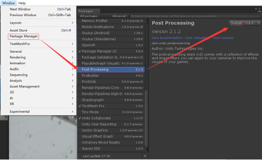

#### 2.For unity 5.6.1-2018.1
Use the GitHub installation. The installation method is detailed in the installation documentation in the github project (https://github.com/Unity-Technologies/PostProcessing).

#### 3.For unity 5.4.3-5.6
Post processing stack (v2) may not work correctly with those old versions unity. If you want to use RaindropFX in those old versions unity, you can choose RaindropFX Lite.

### 2-1-2 Download RaindropFX to your project {docsify-ignore}
If you have an old version RaindropFX, delete it first, then download and import new RaindropFX to your project, and you will see those files:

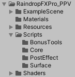

### 2-1-3 Post processing stack setup {docsify-ignore}
#### 1. Camera setup
Select the main camera in your secne, and add a "Post Process Layer" script component. On the component, in the "Layer" dropdown, select the "PostProcessing" layer.

#### 2.Post process volume Setup
Go to "GameObject -> 3D Object -> Post-process Volume" to create a new volume object. On the "Post Process Volume" component, tick the "Global" box, then choose a profile in the profile field or create a new profile.

#### 3.Post process profile setup
On the "Post Process Volume" component, go to "Add effect -> RaindropFX -> CameraLensRain" to add the effect.

### 2-2 Object space version
!> **NOTE** The current version of object space RaindropFX is a non-physical accurate version. Physical calculation of water droplets are totally dependent on the UV space of your model.
So the way of dividing the UV will directly affect the flow of water droplets. 

### 2-2-1 Setup your model {docsify-ignore}
As shown in the figure below, there are two different UV division methods for the same cylinder model:

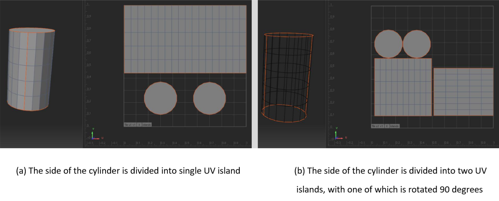

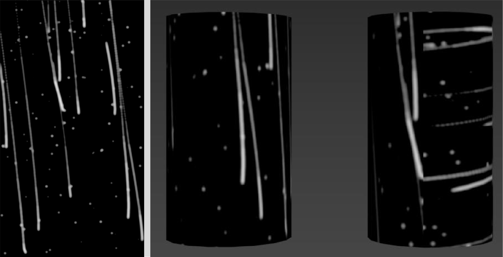

As the figure above shows, left side is the computed raindrop texture. Because of that the flow direction of raindrops is roughly along the v-axis of the UV space, 
so if we apply the texture to the middle cylinder (with UV division method (a)), the result will be correct; 
But if we apply the texture to the right cylinder (with UV division method (b)), the result will be wrong.

!> **IMPORTANT** Therefore, in the process of UV division, 
please try to keep the UV island orientation consistent and try to divide the UV into a whole piece of island. 

### 2-2-2 Setup material & solver {docsify-ignore}
1. Create a material for your model, change the shader type to 'Custom/RaindropFX/WetSurface';

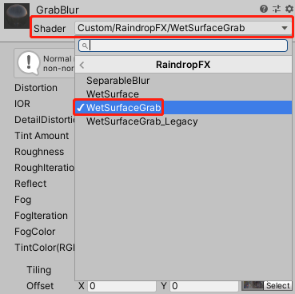

2. Add 'Command Buffer Blur Refraction' and 'Material Linker' to your model object. 
They will try to find the target material (main material of your model) automatically, 
if they failed to get the correct material or if you changed the material of model after scripts have been added, please reset 'Target Mat' manually.

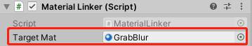

3. Now you can see raindrops on your model surface.

## 3 System options
<table class="MsoTableGrid" border="1" cellspacing="0" cellpadding="0" width="600" style="border-collapse:collapse;mso-table-layout-alt:fixed;border:none;
 mso-border-alt:solid windowtext .5pt;mso-yfti-tbllook:1184;mso-padding-alt:
 0cm 5.4pt 0cm 5.4pt">
 <tbody><tr style="mso-yfti-irow:0;mso-yfti-firstrow:yes;height:46.2pt">
  <td width="218" valign="top" style="width:163.8pt;border:solid black 1.0pt;
  border-right:dotted windowtext 1.0pt;background:black;padding:0cm 5.4pt 0cm 5.4pt;
  height:46.2pt">
  
<b>Parameter<o:p></o:p></b>

  </td>
  <td width="350" valign="top" style="width:262.3pt;border:solid black 1.0pt;
  border-left:none;mso-border-left-alt:dotted windowtext 1.0pt;background:black;
  padding:0cm 5.4pt 0cm 5.4pt;height:46.2pt">
  
<b><o:p>&nbsp;</o:p></b>

  </td>
 </tr>
 <tr style="mso-yfti-irow:1;height:31.2pt">
  <td width="218" valign="top" style="width:163.8pt;border-top:none;border-left:
  solid black 1.0pt;border-bottom:solid black 1.0pt;border-right:dotted windowtext 1.0pt;
  mso-border-top-alt:solid black 1.0pt;background:#E7E7E7;padding:0cm 5.4pt 0cm 5.4pt;
  height:31.2pt">
  
<b>Fadeout_fadein_switch<o:p></o:p></b>

  </td>
  <td width="350" valign="top" style="width:262.3pt;border-top:none;border-left:
  none;border-bottom:solid black 1.0pt;border-right:solid black 1.0pt;
  mso-border-top-alt:solid black 1.0pt;mso-border-left-alt:dotted windowtext 1.0pt;
  background:#E7E7E7;padding:0cm 5.4pt 0cm 5.4pt;height:31.2pt">
  
Waterdrops will fade in/out automatically
  if you disable/enable this.<o:p></o:p>

  </td>
 </tr>
 <tr style="mso-yfti-irow:2;height:31.2pt">
  <td width="218" valign="top" style="width:163.8pt;border-top:none;border-left:
  solid black 1.0pt;border-bottom:solid black 1.0pt;border-right:dotted windowtext 1.0pt;
  mso-border-top-alt:solid black 1.0pt;background:white;padding:0cm 5.4pt 0cm 5.4pt;
  height:31.2pt">
  
<b>Fast mode<o:p></o:p></b>

  </td>
  <td width="350" valign="top" style="width:262.3pt;border-top:none;bRaindropFXPro_PPVorder-left:
  none;border-bottom:solid black 1.0pt;border-right:solid black 1.0pt;
  mso-border-top-alt:solid black 1.0pt;mso-border-left-alt:dotted windowtext 1.0pt;
  background:white;padding:0cm 5.4pt 0cm 5.4pt;height:31.2pt">
  
Works with "Fadeout_fadein_switch". Waterdrops
  will fadeout with higher frame rate but lower accuracy if you turn it on. <o:p></o:p>

  
*It will greatly affect the effect of
  screen fog.<o:p></o:p>

  </td>
 </tr>
 <tr style="mso-yfti-irow:3;height:31.2pt">
  <td width="218" valign="top" style="width:163.8pt;border-top:none;border-left:
  solid black 1.0pt;border-bottom:solid black 1.0pt;border-right:dotted windowtext 1.0pt;
  mso-border-top-alt:solid black 1.0pt;background:#E7E7E7;padding:0cm 5.4pt 0cm 5.4pt;
  height:31.2pt">
  
<b>Fade speed<o:p></o:p></b>

  </td>
  <td width="350" valign="top" style="width:262.3pt;border-top:none;border-left:
  none;border-bottom:solid black 1.0pt;border-right:solid black 1.0pt;
  mso-border-top-alt:solid black 1.0pt;mso-border-left-alt:dotted windowtext 1.0pt;
  background:#E7E7E7;padding:0cm 5.4pt 0cm 5.4pt;height:31.2pt">
  
The speed of waterdrops fadeout. The
  bigger, the faster.<o:p></o:p>

  </td>
 </tr>
 <tr style="mso-yfti-irow:4;height:31.2pt">
  <td width="218" valign="top" style="width:163.8pt;border-top:none;border-left:
  solid black 1.0pt;border-bottom:solid black 1.0pt;border-right:dotted windowtext 1.0pt;
  mso-border-top-alt:solid black 1.0pt;background:white;padding:0cm 5.4pt 0cm 5.4pt;
  height:31.2pt">
  
<b>Raindrop tex_alpha<o:p></o:p></b>

  </td>
  <td width="350" valign="top" style="width:262.3pt;border-top:none;border-left:
  none;border-bottom:solid black 1.0pt;border-right:solid black 1.0pt;
  mso-border-top-alt:solid black 1.0pt;mso-border-left-alt:dotted windowtext 1.0pt;
  background:white;padding:0cm 5.4pt 0cm 5.4pt;height:31.2pt">
  
Raindrop texture must be set before you
  can use RaindropFX. Find the raindrop texture at "RaindropFXPro_PPV/Resources/Textures/raindrop_a".
  Or you can use your own raindrop texture. <o:p></o:p>

  
*The calculation of the program is based
  on the alpha channel of the texture, so PNG format images with alpha channel
  are recommended. <o:p></o:p>

  </td>
 </tr>
 <tr style="mso-yfti-irow:5;height:31.2pt">
  <td width="218" valign="top" style="width:163.8pt;border-top:none;border-left:
  solid black 1.0pt;border-bottom:solid black 1.0pt;border-right:dotted windowtext 1.0pt;
  mso-border-top-alt:solid black 1.0pt;background:#E7E7E7;padding:0cm 5.4pt 0cm 5.4pt;
  height:31.2pt">
  
<b>Force rain texture size<o:p></o:p></b>

  </td>
  <td width="350" rowspan="2" valign="top" style="width:262.3pt;border-top:none;
  border-left:none;border-bottom:solid black 1.0pt;border-right:solid black 1.0pt;
  mso-border-top-alt:solid black 1.0pt;mso-border-left-alt:dotted windowtext 1.0pt;
  background:#E7E7E7;padding:0cm 5.4pt 0cm 5.4pt;height:31.2pt">
  
When turn it on, raindropFX will always
  calculate the screen rain texture of the specified size(Calc Rain Texture
  Size) and then rescale it to the current screen resolution size. When your
  game resolution is very large, opening this option will improve performance.<o:p></o:p>

  </td>
 </tr>
 <tr style="mso-yfti-irow:6;height:31.2pt">
  <td width="218" valign="top" style="width:163.8pt;border-top:none;border-left:
  solid black 1.0pt;border-bottom:solid black 1.0pt;border-right:dotted windowtext 1.0pt;
  mso-border-top-alt:solid black 1.0pt;background:white;padding:0cm 5.4pt 0cm 5.4pt;
  height:31.2pt">
  
<b>Calc rain texture size<o:p></o:p></b>

  </td>
 </tr>
 <tr style="mso-yfti-irow:7;height:31.2pt">
  <td width="218" valign="top" style="width:163.8pt;border-top:none;border-left:
  solid black 1.0pt;border-bottom:solid black 1.0pt;border-right:dotted windowtext 1.0pt;
  mso-border-top-alt:solid black 1.0pt;background:#E7E7E7;padding:0cm 5.4pt 0cm 5.4pt;
  height:31.2pt">
  
<b>Calc time step<o:p></o:p></b>

  </td>
  <td width="350" valign="top" style="width:262.3pt;border-top:none;border-left:
  none;border-bottom:solid black 1.0pt;border-right:solid black 1.0pt;
  mso-border-top-alt:solid black 1.0pt;mso-border-left-alt:dotted windowtext 1.0pt;
  background:#E7E7E7;padding:0cm 5.4pt 0cm 5.4pt;height:31.2pt">
  
The time step of physical calculation.<o:p></o:p>

  </td>
 </tr>
 <tr style="mso-yfti-irow:8;height:31.2pt">
  <td width="218" valign="top" style="width:163.8pt;border-top:none;border-left:
  solid black 1.0pt;border-bottom:solid black 1.0pt;border-right:dotted windowtext 1.0pt;
  mso-border-top-alt:solid black 1.0pt;background:white;padding:0cm 5.4pt 0cm 5.4pt;
  height:31.2pt">
  
<b>Refresh rate<o:p></o:p></b>

  </td>
  <td width="350" valign="top" style="width:262.3pt;border-top:none;border-left:
  none;border-bottom:solid black 1.0pt;border-right:solid black 1.0pt;
  mso-border-top-alt:solid black 1.0pt;mso-border-left-alt:dotted windowtext 1.0pt;
  background:white;padding:0cm 5.4pt 0cm 5.4pt;height:31.2pt">
  
For example, if you set it to 2, the
  raindrop animation will calculate every two frames.<o:p></o:p>

  </td>
 </tr>
 <tr style="mso-yfti-irow:9;height:31.2pt">
  <td width="218" valign="top" style="width:163.8pt;border-top:none;border-left:
  solid black 1.0pt;border-bottom:solid black 1.0pt;border-right:dotted windowtext 1.0pt;
  mso-border-top-alt:solid black 1.0pt;background:#E7E7E7;padding:0cm 5.4pt 0cm 5.4pt;
  height:31.2pt">
  
<b>Generate trail<o:p></o:p></b>

  </td>
  <td width="350" valign="top" style="width:262.3pt;border-top:none;border-left:
  none;border-bottom:solid black 1.0pt;border-right:solid black 1.0pt;
  mso-border-top-alt:solid black 1.0pt;mso-border-left-alt:dotted windowtext 1.0pt;
  background:#E7E7E7;padding:0cm 5.4pt 0cm 5.4pt;height:31.2pt">
  
Controls whether the dynamic water
  droplets produce a tail when they slide. When the dynamic water droplets
  produce a static tail drop, itself loses a certain amount of mass, which will
  affect the results of the physical calculation.<o:p></o:p>

  </td>
 </tr>
 <tr style="mso-yfti-irow:10;height:31.2pt">
  <td width="218" valign="top" style="width:163.8pt;border-top:none;border-left:
  solid black 1.0pt;border-bottom:solid black 1.0pt;border-right:dotted windowtext 1.0pt;
  mso-border-top-alt:solid black 1.0pt;background:white;padding:0cm 5.4pt 0cm 5.4pt;
  height:31.2pt">
  
<b>Max static raindrop number<o:p></o:p></b>

  </td>
  <td width="350" rowspan="2" valign="top" style="width:262.3pt;border-top:none;
  border-left:none;border-bottom:solid black 1.0pt;border-right:solid black 1.0pt;
  mso-border-top-alt:solid black 1.0pt;mso-border-left-alt:dotted windowtext 1.0pt;
  background:white;padding:0cm 5.4pt 0cm 5.4pt;height:31.2pt">
  
Water droplets are divided into two
  categories: static and dynamic. Static water droplets are generated on the
  screen at random locations and cannot be moved. Dynamic water droplets are
  generated by the physical computing movement.<o:p></o:p>

  </td>
 </tr>
 <tr style="mso-yfti-irow:11;height:31.2pt">
  <td width="218" valign="top" style="width:163.8pt;border-top:none;border-left:
  solid black 1.0pt;border-bottom:solid black 1.0pt;border-right:dotted windowtext 1.0pt;
  mso-border-top-alt:solid black 1.0pt;background:#E7E7E7;padding:0cm 5.4pt 0cm 5.4pt;
  height:31.2pt">
  
<b>Max dynamic raindrop number<o:p></o:p></b>

  </td>
 </tr>
 <tr style="mso-yfti-irow:12;height:31.2pt">
  <td width="218" valign="top" style="width:163.8pt;border-top:none;border-left:
  solid black 1.0pt;border-bottom:solid black 1.0pt;border-right:dotted windowtext 1.0pt;
  mso-border-top-alt:solid black 1.0pt;background:white;padding:0cm 5.4pt 0cm 5.4pt;
  height:31.2pt">
  
<b>Raindrop size range<o:p></o:p></b>

  </td>
  <td width="350" valign="top" style="width:262.3pt;border-top:none;border-left:
  none;border-bottom:solid black 1.0pt;border-right:solid black 1.0pt;
  mso-border-top-alt:solid black 1.0pt;mso-border-left-alt:dotted windowtext 1.0pt;
  background:white;padding:0cm 5.4pt 0cm 5.4pt;height:31.2pt">
  
Calculate the size range of raindrops
  based on your raindrop texture.<o:p></o:p>

  </td>
 </tr>
 <tr style="mso-yfti-irow:13;height:31.2pt">
  <td width="218" valign="top" style="width:163.8pt;border-top:none;border-left:
  solid black 1.0pt;border-bottom:solid black 1.0pt;border-right:dotted windowtext 1.0pt;
  mso-border-top-alt:solid black 1.0pt;background:#E7E7E7;padding:0cm 5.4pt 0cm 5.4pt;
  height:31.2pt">
  
<b>Tint color<o:p></o:p></b>

  </td>
  <td width="350" valign="top" style="width:262.3pt;border-top:none;border-left:
  none;border-bottom:solid black 1.0pt;border-right:solid black 1.0pt;
  mso-border-top-alt:solid black 1.0pt;mso-border-left-alt:dotted windowtext 1.0pt;
  background:#E7E7E7;padding:0cm 5.4pt 0cm 5.4pt;height:31.2pt">
  
Tint color for droplets.<o:p></o:p>

  </td>
 </tr>
 <tr style="mso-yfti-irow:14;height:31.2pt">
  <td width="218" valign="top" style="width:163.8pt;border-top:none;border-left:
  solid black 1.0pt;border-bottom:solid black 1.0pt;border-right:dotted windowtext 1.0pt;
  mso-border-top-alt:solid black 1.0pt;background:white;padding:0cm 5.4pt 0cm 5.4pt;
  height:31.2pt">
  
<b>Tint weight<o:p></o:p></b>

  </td>
  <td width="350" valign="top" style="width:262.3pt;border-top:none;border-left:
  none;border-bottom:solid black 1.0pt;border-right:solid black 1.0pt;
  mso-border-top-alt:solid black 1.0pt;mso-border-left-alt:dotted windowtext 1.0pt;
  background:white;padding:0cm 5.4pt 0cm 5.4pt;height:31.2pt">
  
The larger the value, the thicker the
  color.<o:p></o:p>

  </td>
 </tr>
 <tr style="mso-yfti-irow:15;height:31.2pt">
  <td width="218" valign="top" style="width:163.8pt;border-top:none;border-left:
  solid black 1.0pt;border-bottom:solid black 1.0pt;border-right:dotted windowtext 1.0pt;
  mso-border-top-alt:solid black 1.0pt;background:#E7E7E7;padding:0cm 5.4pt 0cm 5.4pt;
  height:31.2pt">
  
<b>Use wind<o:p></o:p></b>

  </td>
  <td width="350" valign="top" style="width:262.3pt;border-top:none;border-left:
  none;border-bottom:solid black 1.0pt;border-right:solid black 1.0pt;
  mso-border-top-alt:solid black 1.0pt;mso-border-left-alt:dotted windowtext 1.0pt;
  background:#E7E7E7;padding:0cm 5.4pt 0cm 5.4pt;height:31.2pt">
  
Tick this if you want to use screen wind.<o:p></o:p>

  </td>
 </tr>
 <tr style="mso-yfti-irow:16;height:31.2pt">
  <td width="218" valign="top" style="width:163.8pt;border-top:none;border-left:
  solid black 1.0pt;border-bottom:solid black 1.0pt;border-right:dotted windowtext 1.0pt;
  mso-border-top-alt:solid black 1.0pt;background:white;padding:0cm 5.4pt 0cm 5.4pt;
  height:31.2pt">
  
<b>Wind turbulence<o:p></o:p></b>

  </td>
  <td width="350" valign="top" style="width:262.3pt;border-top:none;border-left:
  none;border-bottom:solid black 1.0pt;border-right:solid black 1.0pt;
  mso-border-top-alt:solid black 1.0pt;mso-border-left-alt:dotted windowtext 1.0pt;
  background:white;padding:0cm 5.4pt 0cm 5.4pt;height:31.2pt">
  
Controls wind turbulence amount.<o:p></o:p>

  </td>
 </tr>
 <tr style="mso-yfti-irow:17;height:31.2pt">
  <td width="218" valign="top" style="width:163.8pt;border-top:none;border-left:
  solid black 1.0pt;border-bottom:solid black 1.0pt;border-right:dotted windowtext 1.0pt;
  mso-border-top-alt:solid black 1.0pt;background:#E7E7E7;padding:0cm 5.4pt 0cm 5.4pt;
  height:31.2pt">
  
<b>Wind turb scale<o:p></o:p></b>

  </td>
  <td width="350" valign="top" style="width:262.3pt;border-top:none;border-left:
  none;border-bottom:solid black 1.0pt;border-right:solid black 1.0pt;
  mso-border-top-alt:solid black 1.0pt;mso-border-left-alt:dotted windowtext 1.0pt;
  background:#E7E7E7;padding:0cm 5.4pt 0cm 5.4pt;height:31.2pt">
  
Adjust scale of the wind turbulence.<o:p></o:p>

  </td>
 </tr>
 <tr style="mso-yfti-irow:18;height:31.2pt">
  <td width="218" valign="top" style="width:163.8pt;border-top:none;border-left:
  solid black 1.0pt;border-bottom:solid black 1.0pt;border-right:dotted windowtext 1.0pt;
  mso-border-top-alt:solid black 1.0pt;background:white;padding:0cm 5.4pt 0cm 5.4pt;
  height:31.2pt">
  
<b>Wind<o:p></o:p></b>

  </td>
  <td width="350" valign="top" style="width:262.3pt;border-top:none;border-left:
  none;border-bottom:solid black 1.0pt;border-right:solid black 1.0pt;
  mso-border-top-alt:solid black 1.0pt;mso-border-left-alt:dotted windowtext 1.0pt;
  background:white;padding:0cm 5.4pt 0cm 5.4pt;height:31.2pt">
  
Wind power adjustment.<o:p></o:p>

  </td>
 </tr>
 <tr style="mso-yfti-irow:19;height:31.2pt">
  <td width="218" valign="top" style="width:163.8pt;border-top:none;border-left:
  solid black 1.0pt;border-bottom:solid black 1.0pt;border-right:dotted windowtext 1.0pt;
  mso-border-top-alt:solid black 1.0pt;background:#E7E7E7;padding:0cm 5.4pt 0cm 5.4pt;
  height:31.2pt">
  
<b>Radial wind<o:p></o:p></b>

  </td>
  <td width="350" valign="top" style="width:262.3pt;border-top:none;border-left:
  none;border-bottom:solid black 1.0pt;border-right:solid black 1.0pt;
  mso-border-top-alt:solid black 1.0pt;mso-border-left-alt:dotted windowtext 1.0pt;
  background:#E7E7E7;padding:0cm 5.4pt 0cm 5.4pt;height:31.2pt">
  
Enable radial wind, mostly for driving
  simulation.<o:p></o:p>

  </td>
 </tr>
 <tr style="mso-yfti-irow:20;height:31.2pt">
  <td width="218" valign="top" style="width:163.8pt;border-top:none;border-left:
  solid black 1.0pt;border-bottom:solid black 1.0pt;border-right:dotted windowtext 1.0pt;
  mso-border-top-alt:solid black 1.0pt;background:white;padding:0cm 5.4pt 0cm 5.4pt;
  height:31.2pt">
  
<b>Gravity<o:p></o:p></b>

  </td>
  <td width="350" valign="top" style="width:262.3pt;border-top:none;border-left:
  none;border-bottom:solid black 1.0pt;border-right:solid black 1.0pt;
  mso-border-top-alt:solid black 1.0pt;mso-border-left-alt:dotted windowtext 1.0pt;
  background:white;padding:0cm 5.4pt 0cm 5.4pt;height:31.2pt">
  
Gravity adjustment.<o:p></o:p>

  </td>
 </tr>
 <tr style="mso-yfti-irow:21;height:31.2pt">
  <td width="218" valign="top" style="width:163.8pt;border-top:none;border-left:
  solid black 1.0pt;border-bottom:solid black 1.0pt;border-right:dotted windowtext 1.0pt;
  mso-border-top-alt:solid black 1.0pt;background:#E7E7E7;padding:0cm 5.4pt 0cm 5.4pt;
  height:31.2pt">
  
<b>Friction<o:p></o:p></b>

  </td>
  <td width="350" valign="top" style="width:262.3pt;border-top:none;border-left:
  none;border-bottom:solid black 1.0pt;border-right:solid black 1.0pt;
  mso-border-top-alt:solid black 1.0pt;mso-border-left-alt:dotted windowtext 1.0pt;
  background:#E7E7E7;padding:0cm 5.4pt 0cm 5.4pt;height:31.2pt">
  
Friction adjustment.<o:p></o:p>

  </td>
 </tr>
 <tr style="mso-yfti-irow:22;height:31.2pt">
  <td width="218" valign="top" style="width:163.8pt;border-top:none;border-left:
  solid black 1.0pt;border-bottom:solid black 1.0pt;border-right:dotted windowtext 1.0pt;
  mso-border-top-alt:solid black 1.0pt;background:white;padding:0cm 5.4pt 0cm 5.4pt;
  height:31.2pt">
  
<b>Distortion<o:p></o:p></b>

  </td>
  <td width="350" valign="top" style="width:262.3pt;border-top:none;border-left:
  none;border-bottom:solid black 1.0pt;border-right:solid black 1.0pt;
  mso-border-top-alt:solid black 1.0pt;mso-border-left-alt:dotted windowtext 1.0pt;
  background:white;padding:0cm 5.4pt 0cm 5.4pt;height:31.2pt">
  
Screen blend effect intensity. The larger
  the value, the stronger the distortion.<o:p></o:p>

  </td>
 </tr>
 <tr style="mso-yfti-irow:23;height:31.2pt">
  <td width="218" valign="top" style="width:163.8pt;border-top:none;border-left:
  solid black 1.0pt;border-bottom:solid black 1.0pt;border-right:dotted windowtext 1.0pt;
  mso-border-top-alt:solid black 1.0pt;background:#E7E7E7;padding:0cm 5.4pt 0cm 5.4pt;
  height:31.2pt">
  
<b>Use fog<o:p></o:p></b>

  </td>
  <td width="350" valign="top" style="width:262.3pt;border-top:none;border-left:
  none;border-bottom:solid black 1.0pt;border-right:solid black 1.0pt;
  mso-border-top-alt:solid black 1.0pt;mso-border-left-alt:dotted windowtext 1.0pt;
  background:#E7E7E7;padding:0cm 5.4pt 0cm 5.4pt;height:31.2pt">
  
If you want to use screen fog, turn it on.<o:p></o:p>

  </td>
 </tr>
 <tr style="mso-yfti-irow:24;height:31.2pt">
  <td width="218" valign="top" style="width:163.8pt;border-top:none;border-left:
  solid black 1.0pt;border-bottom:solid black 1.0pt;border-right:dotted windowtext 1.0pt;
  mso-border-top-alt:solid black 1.0pt;background:white;padding:0cm 5.4pt 0cm 5.4pt;
  height:31.2pt">
  
<b>Fog intensity<o:p></o:p></b>

  </td>
  <td width="350" valign="top" style="width:262.3pt;border-top:none;border-left:
  none;border-bottom:solid black 1.0pt;border-right:solid black 1.0pt;
  mso-border-top-alt:solid black 1.0pt;mso-border-left-alt:dotted windowtext 1.0pt;
  background:white;padding:0cm 5.4pt 0cm 5.4pt;height:31.2pt">
  
Screen fog effect intensity.<o:p></o:p>

  </td>
 </tr>
 <tr style="mso-yfti-irow:25;height:31.2pt">
  <td width="218" valign="top" style="width:163.8pt;border-top:none;border-left:
  solid black 1.0pt;border-bottom:solid black 1.0pt;border-right:dotted windowtext 1.0pt;
  mso-border-top-alt:solid black 1.0pt;background:#E7E7E7;padding:0cm 5.4pt 0cm 5.4pt;
  height:31.2pt">
  
<b>Fog iteration<o:p></o:p></b>

  </td>
  <td width="350" valign="top" style="width:262.3pt;border-top:none;border-left:
  none;border-bottom:solid black 1.0pt;border-right:solid black 1.0pt;
  mso-border-top-alt:solid black 1.0pt;mso-border-left-alt:dotted windowtext 1.0pt;
  background:#E7E7E7;padding:0cm 5.4pt 0cm 5.4pt;height:31.2pt">
  
Controls the effect of water droplet wake
  on fog.<o:p></o:p>

  </td>
 </tr>
 <tr style="mso-yfti-irow:26;height:31.2pt">
  <td width="218" valign="top" style="width:163.8pt;border-top:none;border-left:
  solid black 1.0pt;border-bottom:solid black 1.0pt;border-right:dotted windowtext 1.0pt;
  mso-border-top-alt:solid black 1.0pt;background:white;padding:0cm 5.4pt 0cm 5.4pt;
  height:31.2pt">
  
<b>Edge softness<o:p></o:p></b>

  </td>
  <td width="350" valign="top" style="width:262.3pt;border-top:none;border-left:
  none;border-bottom:solid black 1.0pt;border-right:solid black 1.0pt;
  mso-border-top-alt:solid black 1.0pt;mso-border-left-alt:dotted windowtext 1.0pt;
  background:white;padding:0cm 5.4pt 0cm 5.4pt;height:31.2pt">
  
Edge softness of water droplets.<o:p></o:p>

  </td>
 </tr>
 <tr style="mso-yfti-irow:27;height:31.2pt">
  <td width="218" valign="top" style="width:163.8pt;border-top:none;border-left:
  solid black 1.0pt;border-bottom:solid black 1.0pt;border-right:dotted windowtext 1.0pt;
  mso-border-top-alt:solid black 1.0pt;background:white;padding:0cm 5.4pt 0cm 5.4pt;
  height:31.2pt">
  
<b>In black<o:p></o:p></b>

  </td>
  <td width="350" rowspan="4" valign="top" style="width:262.3pt;border-top:none;
  border-left:none;border-bottom:solid black 1.0pt;border-right:solid black 1.0pt;
  mso-border-top-alt:solid black 1.0pt;mso-border-left-alt:dotted windowtext 1.0pt;
  background:white;padding:0cm 5.4pt 0cm 5.4pt;height:31.2pt">
  
Color level parameters. <o:p></o:p>

  
Can be used to adjust the "cutoff" effect
  of waterdrop edge.<o:p></o:p>

  </td>
 </tr>
 <tr style="mso-yfti-irow:28;height:31.2pt">
  <td width="218" valign="top" style="width:163.8pt;border-top:none;border-left:
  solid black 1.0pt;border-bottom:solid black 1.0pt;border-right:dotted windowtext 1.0pt;
  mso-border-top-alt:solid black 1.0pt;background:#E7E7E7;padding:0cm 5.4pt 0cm 5.4pt;
  height:31.2pt">
  
<b>In white<o:p></o:p></b>

  </td>
 </tr>
 <tr style="mso-yfti-irow:29;height:31.2pt">
  <td width="218" valign="top" style="width:163.8pt;border-top:none;border-left:
  solid black 1.0pt;border-bottom:solid black 1.0pt;border-right:dotted windowtext 1.0pt;
  mso-border-top-alt:solid black 1.0pt;background:white;padding:0cm 5.4pt 0cm 5.4pt;
  height:31.2pt">
  
<b>Out white<o:p></o:p></b>

  </td>
 </tr>
 <tr style="mso-yfti-irow:30;height:31.2pt">
  <td width="218" valign="top" style="width:163.8pt;border-top:none;border-left:
  solid black 1.0pt;border-bottom:solid black 1.0pt;border-right:dotted windowtext 1.0pt;
  mso-border-top-alt:solid black 1.0pt;background:#E7E7E7;padding:0cm 5.4pt 0cm 5.4pt;
  height:31.2pt">
  
<b>Out black<o:p></o:p></b>

  </td>
 </tr>
 <tr style="mso-yfti-irow:31;height:31.2pt">
  <td width="218" valign="top" style="width:163.8pt;border-top:none;border-left:
  solid black 1.0pt;border-bottom:solid black 1.0pt;border-right:dotted windowtext 1.0pt;
  mso-border-top-alt:solid black 1.0pt;background:white;padding:0cm 5.4pt 0cm 5.4pt;
  height:31.2pt">
  
<b>Droplet blur<o:p></o:p></b>

  </td>
  <td width="350" valign="top" style="width:262.3pt;border-top:none;border-left:
  none;border-bottom:solid black 1.0pt;border-right:solid black 1.0pt;
  mso-border-top-alt:solid black 1.0pt;mso-border-left-alt:dotted windowtext 1.0pt;
  background:white;padding:0cm 5.4pt 0cm 5.4pt;height:31.2pt">
  
Enable this to blur foreground waterdrops.<o:p></o:p>

  </td>
 </tr>
 <tr style="mso-yfti-irow:32;height:31.2pt">
  <td width="218" valign="top" style="width:163.8pt;border-top:none;border-left:
  solid black 1.0pt;border-bottom:solid black 1.0pt;border-right:dotted windowtext 1.0pt;
  mso-border-top-alt:solid black 1.0pt;background:#E7E7E7;padding:0cm 5.4pt 0cm 5.4pt;
  height:31.2pt">
  
<b>Focalize<o:p></o:p></b>

  </td>
  <td width="350" valign="top" style="width:262.3pt;border-top:none;border-left:
  none;border-bottom:solid black 1.0pt;border-right:solid black 1.0pt;
  mso-border-top-alt:solid black 1.0pt;mso-border-left-alt:dotted windowtext 1.0pt;
  background:#E7E7E7;padding:0cm 5.4pt 0cm 5.4pt;height:31.2pt">
  
Adjust focal length.<o:p></o:p>

  </td>
 </tr>
 <tr style="mso-yfti-irow:33;height:31.2pt">
  <td width="218" valign="top" style="width:163.8pt;border-top:none;border-left:
  solid black 1.0pt;border-bottom:solid black 1.0pt;border-right:dotted windowtext 1.0pt;
  mso-border-top-alt:solid black 1.0pt;background:white;padding:0cm 5.4pt 0cm 5.4pt;
  height:31.2pt">
  
<b>Blur iteration<o:p></o:p></b>

  </td>
  <td width="350" valign="top" style="width:262.3pt;border-top:none;border-left:
  none;border-bottom:solid black 1.0pt;border-right:solid black 1.0pt;
  mso-border-top-alt:solid black 1.0pt;mso-border-left-alt:dotted windowtext 1.0pt;
  background:white;padding:0cm 5.4pt 0cm 5.4pt;height:31.2pt">
  
Adjust blur strength.<o:p></o:p>

  </td>
 </tr>
 <tr style="mso-yfti-irow:34;height:31.2pt">
  <td width="218" valign="top" style="width:163.8pt;border-top:none;border-left:
  solid black 1.0pt;border-bottom:solid black 1.0pt;border-right:dotted windowtext 1.0pt;
  mso-border-top-alt:solid black 1.0pt;background:#E7E7E7;padding:0cm 5.4pt 0cm 5.4pt;
  height:31.2pt">
  
<b>Show steps<o:p></o:p></b>

  </td>
  <td width="350" valign="top" style="width:262.3pt;border-top:none;border-left:
  none;border-bottom:solid black 1.0pt;border-right:solid black 1.0pt;
  mso-border-top-alt:solid black 1.0pt;mso-border-left-alt:dotted windowtext 1.0pt;
  background:#E7E7E7;padding:0cm 5.4pt 0cm 5.4pt;height:31.2pt">
  
Show calculation steps of screen rain
  texture.<o:p></o:p>

  </td>
 </tr>
 <tr style="mso-yfti-irow:35;mso-yfti-lastrow:yes;height:31.2pt">
  <td width="218" valign="top" style="width:163.8pt;border-top:none;border-left:
  solid black 1.0pt;border-bottom:solid black 1.0pt;border-right:dotted windowtext 1.0pt;
  mso-border-top-alt:solid black 1.0pt;background:white;padding:0cm 5.4pt 0cm 5.4pt;
  height:31.2pt">
  
<b>Debug log<o:p></o:p></b>

  </td>
  <td width="350" valign="top" style="width:262.3pt;border-top:none;border-left:
  none;border-bottom:solid black 1.0pt;border-right:solid black 1.0pt;
  mso-border-top-alt:solid black 1.0pt;mso-border-left-alt:dotted windowtext 1.0pt;
  background:white;padding:0cm 5.4pt 0cm 5.4pt;height:31.2pt">
  
Enable this if you want to see debug info.
  Usually do not need to tick.<o:p></o:p>

  </td>
 </tr>
</tbody></table>

## 4 Bonus content

### 4-1 Batch image renderer
The processing flow of Batch Image Renderer is as follows :
1. 'Batch Sequence Renderer' can be used to render your custom sequence frames to the screen in order;
2. Then you can further applying other post-processing stacks to the input sequence frames; 
3. Finally, you can use the 'Screen Shoter' to save the processed sequence to your local disk.

### 4-1-1 Import your image sequence {docsify-ignore}
First, put all your pictures into 'Assets/Resources/Pictures', if this folder does not exist, create it :

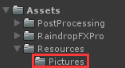

### 4-1-2 Setup 'Batch Sequence Renderer' {docsify-ignore}
On the "Post Process Volume" component, go to "Add effect -> RaindropFX -> Batch Sequence Renderer" to add the renderer :

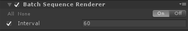

'interval' means that each frame of your input sequence will be rendered to the screen in every n frames.

!> **IMPORTANT** This tool will only start when you click the 'Run' button.

!> **NOTE** If you want to render raindrop effects to input sequence, when 'interval' is set to a small value (e.g. 1), 
the water droplets on the output frames will looks like the same because the interval between each frame is too small, 
which will leads to very small time steps in physical calculations. 
So if you want to make a significant change in the state of the water drops on each frame, increase the 'interval' value.

### 4-1-3 Applying other post effects {docsify-ignore}
On the "Post Process Volume" component, go to "Add effect -> RaindropFX" to add other post effects you prefer. 
All the effects you added will be applied to the input sequence.

### 4-1-4 Setup 'Screen shoter' {docsify-ignore}
On the "Post Process Volume" component, go to "Add effect -> RaindropFX -> Screen Shoter" to add the screen shoter :

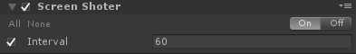

The image will be captured in every 'interval' frames and the 
captured images will be saved to the 'Assets/StreamingAssets/Output' folder automatically :

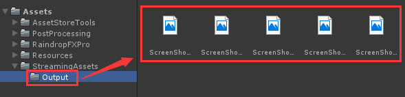

!> **IMPORTANT** This tool will only start when you click the 'Run' button. 

### 4-1-5 Sorting post effects {docsify-ignore}
First, keep the value of 'interval' in both 'Batch Sequence Renderer' and 'Screen Shoter' as the same. Then, on the "Post Process Layer" component, 
sort after stacks manually, please make sure that 'Batch Sequence Renderer' is at the top, 'Screen Shoter' is at bottom.

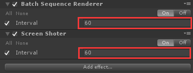

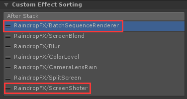

Finally, run the game and all the input images in the 'Pictures' folder will be applied with post-effects you have been added before being output to the 'Output' folder.

### 4-2 Bonus post stacks
### 4-2-1 Screen blur effect {docsify-ignore}
On the "Post Process Volume" component, go to "Add effect -> RaindropFX -> Blur" to add the blur effect :

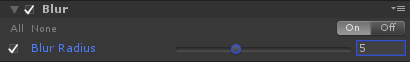

It can blur your screen based on Gaussian Blur :

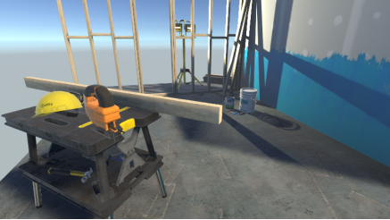

Without blur effect

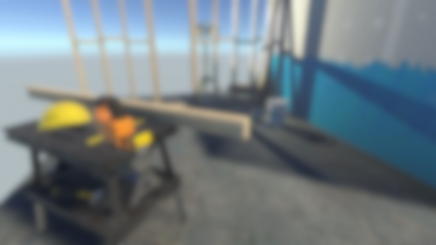

With blur effect

### 4-2-2 Ground glass effect {docsify-ignore}
On the "Post Process Volume" component, go to "Add effect -> RaindropFX -> Screen Blend" to add the screen blend effect :

It can create ground glass effect based on your Height Map/Normal Map, and can achieve color mixing effects based on your Color Map :

Without screen blend effect

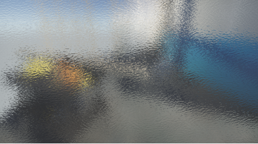

With screen blend effect

### 4-2-3 Multi-player split screen {docsify-ignore}
On the "Post Process Volume" component, go to "Add effect -> RaindropFX -> Split Screen" to add the split screen effect :

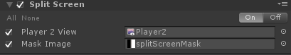

Then you should create another camera for player2 and create an render texture for camera2 as render target :

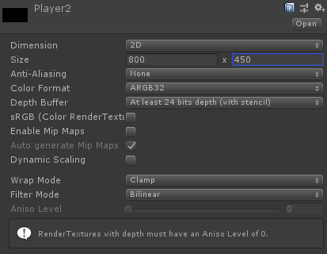

Set render texture size to as same as your main camera

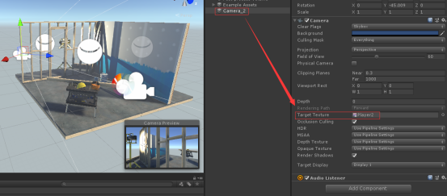

Drag and drop the render texture to target texture of your camera2

Use an grayscale map as split mask, white part is the camera view of player2

Without split screen effect

With split screen effect

### 4-2-4 Color level effect {docsify-ignore}
On the "Post Process Volume" component, go to "Add effect -> RaindropFX -> Color Level" to add the color level effect :

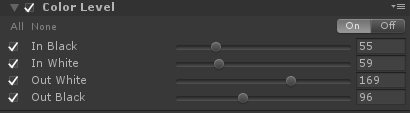

Without color level effect

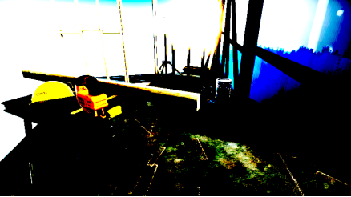

With color level effect

## Support
If you have any questions, comments, or requests for new features, please email me directly at: hztmailbox@gmail.com.

 
 

Welcome to visit my homepage: https://huanime.com.cn/.